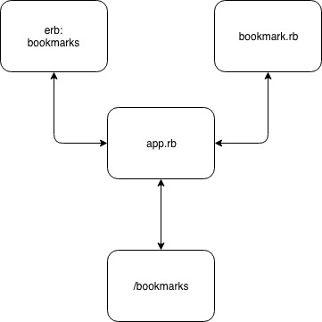

# bookmark_manager

## user stories

As a user of the website  
So that I can easily navigate to my favourite websites  
I want to see a list of bookmarks  

## domain model

## To set up a new bookmarks database:
1. Connect to psql  
2. Create the database using the psql command CREATE DATABASE bookmark_manager;  
3. Connect to the database using the pqsl command \c bookmark_manager;  
4. Run the query we have saved in the file 01_create_bookmarks_table.sql
